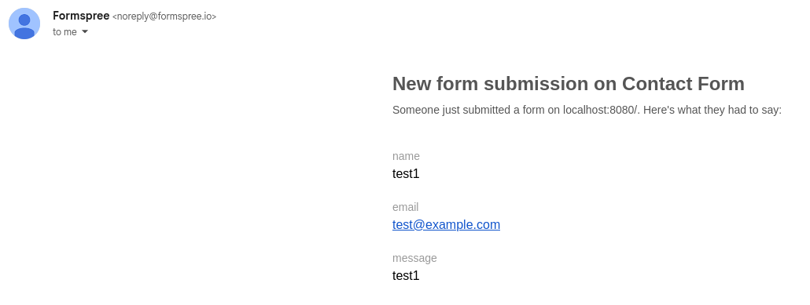

# CS-563 Final Prject Journal

## Commit 1: Initial setup

**Files:** In this first commit I created the initial file structure:

```
- 
| - index.html
| - main.js
| - styles.css
| - assets/
```

**HTML:** In addition to the usual HTML boilerplate for the header/footer, I setup the four required `<section>`'s for the page (#about, 
#work, #projects, #contact). I also included the links to each of those sections in the nav-bar and added an aria-label for accessibility. 

**CSS:** For the initial basic styling I added CSS custom properties under `:root` for the colors (using solarized colorscheme). I also added
the smooth scroll attribute since it is a single page site.

I also styled the nav-bar, using a flexbox layout, with the page title on the left and the links (list) on the right. I included underline/accent
color hover effects for the links.

**Issues:** 
None

**Outside Sources:**

- Solarized Color Palette: https://ethanschoonover.com/solarized/

## Commit 2: Static Sections

**What I worked on:** In this commit I built all the static sections of the page (#about, #work, #contact, and #footer) as follows:

**About:**
I setup a two-column grid layout via `grid-template-columns` with 1fr 2fr and center alignment in order to vertically center the photo next to the biographical text content. As shown in class I also wrapped the photo in the `<figure>` and `<figcaption>` elements.

**Work:**
I used two `<article>` elements within a grid container 1fr 1fr in order to make two "job cards". Each card has a different background-color and a 1px solid border so as to pop out. For the dates I used the more semantic `<time>` elements with the datetime attributes. The company name also uses the `--accent` color to create a visual visual hierarchy. I also gave the whole section a background to visually separate it from the earlier About section.

**Skills:**
For this section I also used a grid display (repeat(3, 1fr)) with three `<div class="skills-group">` styled columns. The individual skill items are then listed with `<li>` elements with but using list-style of none.

**Contact:**
This section is made with three `<div class="form-group">`'s each containing a `<label>` with block display and a corresponding `<input>` or `<textarea>` element. JS validation will come in a later commit.

**Footer:**
The footer is just a flex display with a space-between justify-content. The contect is just copyright text on the left and a GitHub link on the right. I styled the link with `--text-muted` color for default and `--accent` on hover. I plan to add more links down here in later commits.

**Issues:**
None at this stage.

**Outside sources:**
None.

## Commit 3: Projects Section via Github API

**HTML/CSS:** The projects section of the HTML is an empty grid (to be filled in by JS). This is styled as a grid display (repeat(4, 1fr)) of four "project cards" per a row. Each individual project card uses a flex display (column flex direction), and space-between content justification to push the footer towards the bottom. To give the language keys unique per-language colors I also made a class for each language (project-lang--cpp, project-lang--c, etc.) to map each to a specific CSS property color definition. Project stats also needed to ave a flex display and a `--text-muted` color to keep it visually below the project name and description.

**JS:** The process of creating the project cards is split between two functions:

- `fetchProjects`: this function handles the API request `https://api.github.com/users/${GITHUB_USERNAME}/repos?sort=pushed&direction=desc&per_page=8`. This fetches the 8 most recently pushed repos for my GitHub accont. This function returns the fetch response as JSON, filters out forks, and with `.forEach` steps through each repo and calls `buildProjectCard` and appends it's returned object to the projects grid queried from the DOM.

- `buildProjectCard`: The goal of this function is to build and return an individual project card. It takes a single deserialized JSON repo object as an arg and then extracts the following fields:
    - `repo.name`
    - `repo.description`
    - `repo.language`
    - `repo.html_url`
    - `repo.stargazers_count`
    - `repo.forks_count`
    - `repo.open_issues_count`

  and then adds them to the corresponding place of the DOM object to fill out the card contents, before finally retuning the card object.

**Issues:**
I was having a hard time with the stars part of the stats for the card. to figure out why I `curl`'d the API endpoint and read through the response, and noticed I had the field name wrong! After fixing that it appeared as I expted it to.

**Outside sources:**

- GitHub API: https://docs.github.com/en/rest?apiVersion=2026-03-10

## Commit 4: Form Validation + Formspree serverless submission

**HTML/CSS:** Updated the action on the contact form to point to the Formspree endpoint. No errors are displayed yet. JS to add and remove those will come in a later commit, for now I am just using console logs.

**JS:** I added an event listener to `contact-form` and added two functions to both handle and validate the form submission event:

- `isValidEmail`: This is a simple helper function that uses REGEX to test the email string is (likely) a valid email address.
- `handleSubmit`: This is the even handler for the form's submit button. `prevenDefault` is called at the top to prevent the page from navigating to the Formspree endpoint. From there the function grabs the form fields from the DOM and confirms they are non-empty and that the email string is in the right format. For now failures are just output to the console. If all validations pass, `fetch` is used to perform an HTTP POST to the Formspree endpoint with the `FormData(form)` as the body. Note the `Accept: application/json` header to deal with CORS.

**Issues:**

- Initially I would get the following error when trying to submit: `Cross-Origin Request Blocked: The Same Origin Policy disallows reading the remote resource at https://formspree.io/thanks?language=en. (Reason: CORS header ‘Access-Control-Allow-Origin’ missing). Status code: 200`. Eventually I was able to find Formspree includes a script that implements the same logic I am doing manually (see Outside sources below). From there I saw that they were including the following with their POST request:

```javascript
mode: 'cors',
headers: { Accept: 'application/json' },
```

After adding the header and changin the mode to `cors` the form would submit.



- Once I fixed the CORS issue, I would get redirected to the endpoint when I submitted. I eventually looked at the `16-forms.js` in the code-samples and saw `prevenDefault` was at the top of the event handler. Adding that to my handler fixed this issue.

**Outside sources:**

- Email validation regex: https://medium.com/@sketch.paintings/email-validation-with-javascript-regex-e1b40863ed23
- Formspree Source Code: https://github.com/formspree/formspree-js/blob/main/packages/formspree-core/src/core.ts

## Commit 5: Form Erros + Dialog

**HTML/CSS:** Created `form-error` class with block display and `--red` coloring. These will be used by error spans added during validation if any issues are fond. I also created a popup overlay as a container class for the success dialog. This container is a flex display with centered justification and alignmnet and it has a high `z-index` so as to be placed above everything else. The success dialog is then styled with a `max-width` of 24rem, so it looks like a dialog box with its sizing.

**JS:** I added teh building and appending of the success dialog to the `.then()` block after the Formspree response. This follows the usual declaring elements, setting classes, attributes, and contents. From there elements are appended in the right order of containment and an event listener is added the the 'OK' button for removing the overlay when pressed.

**Issues:** 
None

**Outside sources:**

- Using `insertAdjacentElement` for adding the error messages after inputs as siblings: https://codingnomads.com/create-element-javascript

## Commit 6:
